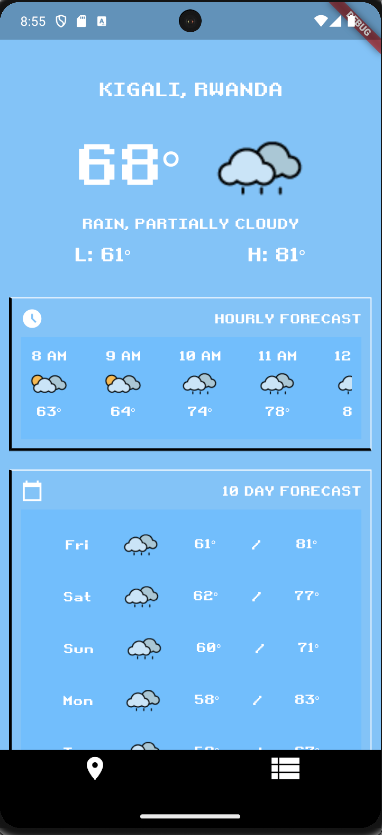
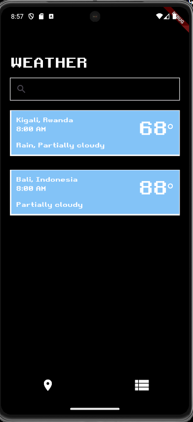

# retro-weather-app

weather application (android/ios) but retro style

## main weather page

## city search page

## 3 different themes

## APIs used

- Visual Crossing's weather API
- Google's Places Autocomplete API
